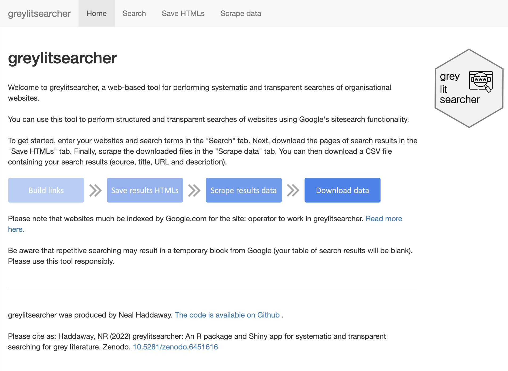
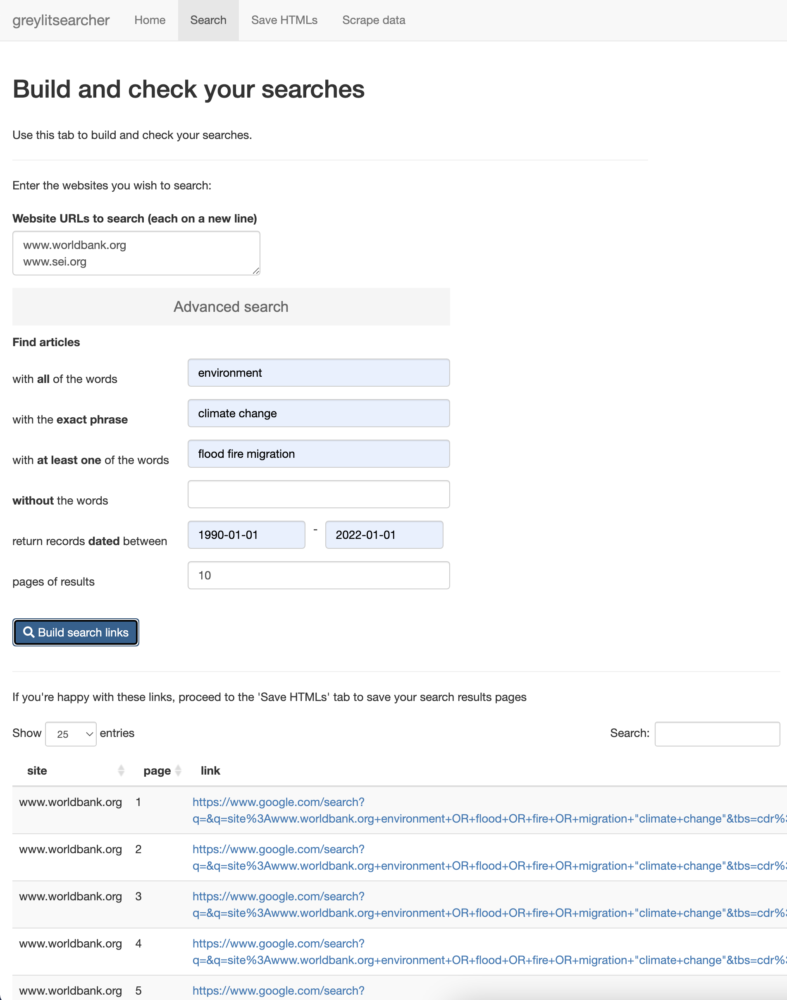
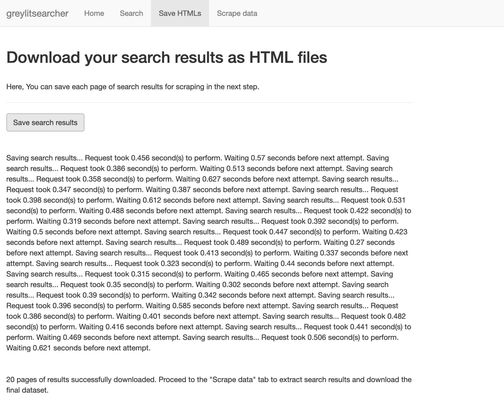
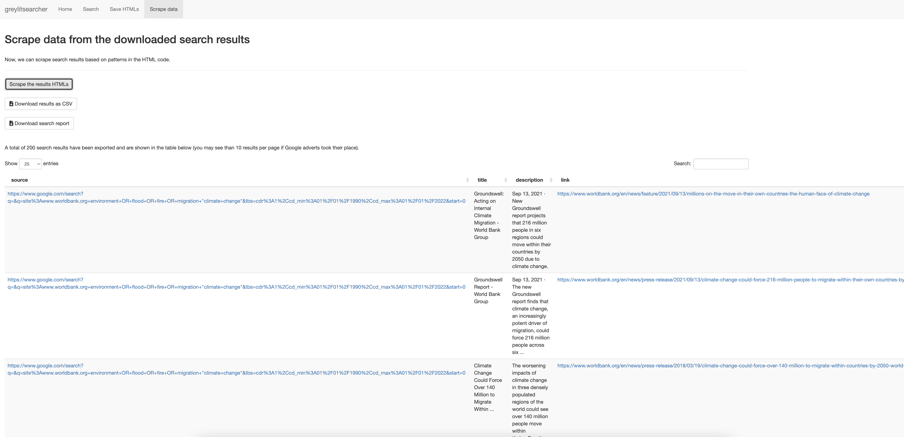
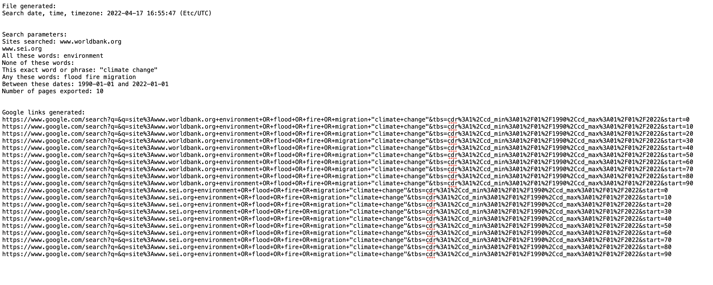

# greylitsearcher 

greylitsearcher is a web-based tool for performing systematic and transparent searches of organisational websites. It does so by using the 'site:' token in a traditional Google search, returning only those results found across that site domain.  

The Shiny app is available here: <a href="https://estech.shinyapps.io/greylitsearcher/">https://estech.shinyapps.io/greylitsearcher/</a>.  

Please note that websites much be indexed by Google.com for the site: operator to work in greylitsearcher. Read more <a href="https://developers.google.com/search/docs/advanced/debug/search-operators/all-search-site" target="_blank">here</a>.  

Be aware that repetitive searching may result in a temporary block from Google (your table of search results will be blank). Please use this tool responsibly.

## Instructions
1. Enter your search terms in the data entry field and click 'Build search links'  
   
 
2. Save the HTML code for each link  
   
 
3. Scrape the results from each page of results  
   
 
4. Download your search results and a text record of your search  
   
